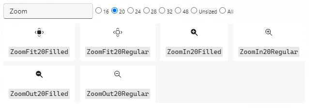

# TypeScript

在 Web 前端领域，有很多用于构建用户界面的库和框架，如 React、Vue.js、Solid.js 和 Svelte。其中的
React 是一个比较流行的库，它使用 JSX（JavaScript XML）作为语法扩展，通过组件化方式，允许开发者将用户界面拆分成独立的、可重用的部分，简化了开发和维护的过程。此外，CSS 解决方案如 CSS Modules、Sass 和 Tailwind CSS 也被广泛使用，以帮助开发者更好地管理和组织样式。还有 Webpack、rollup 这样的工具用于管理、打包资源文件。

TypeScript 是 JavaScript 的超集，增加了可选的静态类型和基于类的面向对象编程。选择 TypeScript 可以更好地融合 Web 前端的一些技术，而且借助 JavaScript 的生态系统，我们还可以开发一些工具和库来增强 UI 开发体验，包括但不限于：

- 集成 CSS Modules、Sass 和 Tailwind CSS 等方案解决 CSS 样式问题
- 提供类似于 Webpack 的能力来组织、加载和打包资源文件
- 添加图标库、组件库、工具库来简化界面开发

这样一来，我们就可以用 TypeScript、JSX、React 再搭配各种工具和库来开发用户界面，相比于使用 C 搭配 XML 和 CSS 来编写界面，React 的声明式编程方式使得状态绑定、事件绑定、条件渲染、列表渲染和资源引入更加简洁和直观。使用 JSX 可以让开发者在同一文件中处理逻辑和视图，减少了上下文切换，开发效率也更高。

## 用法概览

不用担心，你无需花费大量时间去深入学习 TypeScript 语言，因为用户界面相关的代码仅涉及一些基本且常见的语法，所以大多数情况下你只需要参考以下代码片段来编写即可：

```tsx
import { useState, TextInput, Button, useRef, Text } from "@lcui/react";
import { EmojiSparkle } from "@lcui/react-icons";

export default function App() {
  const inputRef = useRef();
  const [name, setName] = useState("LCUI");

  return (
    <div className="container">
      <div className="flex flex-col items-center pt-6">
        <EmojiSparkle fontSize={40} className="text-yellow-500" />
        <Text className="my-4 text-2xl text-center">Hello, {name}!</Text>
        <TextInput
          $ref={inputRef}
          className="mt-2"
          placeholder="Please input..."
        />
        <Button
          className="mt-2"
          onClick={() => setName(inputRef.current.value)}
        >
          Change
        </Button>
      </div>
    </div>
  );
}
```

## 常用语法

### `import`

导入由另一个模块导出的绑定，你可以使用 `import` 语句引入 JavaScript 模块、图片、CSS 样式文件、字体文件等文件。

:::note
参考：https://developer.mozilla.org/zh-CN/docs/Web/JavaScript/Reference/Statements/import
:::

### `export`

导出值。与 default 组合使用时表示声明为默认导出。

:::note
参考：https://developer.mozilla.org/zh-CN/docs/Web/JavaScript/Reference/Statements/export
:::

### `const`

声明用于声明块作用域的局部变量。

:::note
参考：https://developer.mozilla.org/zh-CN/docs/Web/JavaScript/Reference/Statements/const
:::

## 开发工具

`@lcui/cli` 是一个命令行工具，集成了包括 TypeScript 编译器、Sass 预处理器、资源文件加载器等在内的一些与 LCUI 应用程序开发相关的功能。

它依赖 JavaScript 运行时环境，你需要先[安装 Node.js](https://nodejs.org/en/download)，然后运行以下命令安装它：

```bash
npm install -g @lcui/cli
```

## 预处理

LCUI 所采用的 TypeScript 支持方案是预处理器，相较于内置 JavaScript 引擎和 JavaScript 到 C 的编译器这两种方案，它的实现成本和复杂度都比较低，而且未来也可以增加对部分 JavaScript 语法的编译能力。

预处理器的文件加载方式参考了 Webpack，由加载器（Loader）提供特定类型文件的加载和编译能力，根据文件后缀名来匹配合适的加载器。预处理器在处理 TypeScript 文件时，会先调用 TypeScript 加载器解析文件内的代码，获取其依赖的模块并加载它们，然后将该文件转换为 JavaScript 模块，之后执行它，根据组件函数内部的函数调用行为和返回结果，生成相应的 C 源文件。

这一处理过程与 C 编译器的预处理类似，你可以理解为你写的 tsx 文件是配置文件，里面的 TypeScript 代码都是预处理指令，它只在预处理阶段执行，并不会成为运行时代码。

## React 库

`@lcui/react` 是一个针对 LCUI 的特性和预处理器工作模式的用户界面库，提供了一些预置组件、工具函数以及 Hook 函数。它相当于 LCUI 版的 React 库，让你可以像写 React 组件一样写 LCUI 的组件。不过，它目前提供的功能很有限，你只能声明组件的状态、数据绑定和事件绑定，对于条件渲染、列表渲染等复杂的操作，你仍需要编写 C 代码。

安装方法：

```bash
npm install @lcui/react
```

### 组件函数

预处理器的 TypeScript 加载器会调用 `@lcui/react` 库的 `render` 函数来渲染组件，其内部实现就是直接执行组件函数，收集组件函数内执行的 `useState`、`useRef` 等函数产出的数据和组件函数返回的 JSX 元素，然后转换成 C 代码。

:::caution

- 组件函数返回值的必须是一个 JSX 元素，不能是 `<Fragment>`、null、undefined、字符串、数字等对象。
- 暂不支持声明和传递组件 `props` 参数。

:::

### 状态管理

`useState` 函数用于为组件声明一个状态变量，用法如下：

```tsx
import { useState } from '@lcui/react';

function MyComponent() {
  const [age, setAge] = useState(23);
  const [name, setName] = useState('Taylor');
  // ...
```

按照惯例使用 [数组解构](https://javascript.info/destructuring-assignment) 来命名状态变量，例如 `[something, setSomething]`。

`useState` 返回一个只包含两个项的数组：

- 该状态变量，初始值为你传给 `useState` 的值。
- set 函数，它允许你在响应交互时将状态变量更改为任何其他值。

`useState` 函数会为组件的状态结构体添加一个成员，然后在组件的状态初始化函数中添加该成员的初始化代码。以上面的代码片段为例，`useState` 函数会生成以下 C 代码：

```c
// 组件状态结构体
struct MyComponent_state {
  int age;
  char *name;
};

// 组件初始化函数中的代码
_that->state.age = 23;
_that->state.name = strdup2('Taylor');
```

状态的 set 函数会在当前函数作用域中插入用于变更状态的 C 代码，例如执行 `setAge(30)`，会生成：

```c
_that->state.age = 30;
```

:::caution
`useState` 的参数只能是 string、number 类型。
:::

:::note
如需了解更多，请参考 React 文档：https://zh-hans.react.dev/reference/react/useState
:::

### 引用

为了操作特定的组件，我们通常会创建一个变量来引用该组件对象。在 JSX 中这一创建操作可以靠设置 `$ref` 属性来完成：

```tsx
<Input $ref="input" />
```

之后你就可以在 C 代码中使用它来操作组件对象，例如：

```c
ui_textinput_set_content(_that->refs.input, "hello");
```

:::info
为什么不命名为 `ref`？因为在 React 中传递 `ref` 需要使用 [`forwardRef`](https://react.docschina.org/reference/react/forwardRef) 函数，写起来比较麻烦。
:::

`$ref` 属性的值还可以是 `useRef` 函数返回的引用对象：

```tsx
import { useRef } from '@lcui/react';

function MyComponent() {
  const inputRef = useRef();

  return <Input $ref={inputRef} />
}
```

该引用对象只有单个 `current` 属性，它绑定了组件对象，允许你在 TypeScript 中声明它的操作方式。不过，目前 `useRef` 只实现了 TextInput 组件的 value 属性的读写操作绑定，用法如下：

```tsx
inputRef.current.value = 'World';

<Button onClick={() => setName(inputRef.current.value)}>Click</Button>
```

:::caution
`@lcui/react` 库的 `useRef` 和 React 库中的 `useRef` 不一样，仅用于引用特定的组件对象。
:::

:::note
如需了解更多，请参考 React 文档：https://zh-hans.react.dev/reference/react/useRef
:::

### 响应事件

你可以在 JSX 中通过设置 `on + 事件名` 属性来声明事件处理函数，例如声明按钮的点击（Click）事件处理函数：

```tsx
export default function Button() {
  return (
    <Button onClick="handleClick">
      点我
    </Button>
  );
}
```

预处理器将会生成这样的 C 代码来绑定事件处理函数：

```c
ui_widget_on(_that->refs.ref_0, "click", handleClick, w);
```

你也可以将 JavaScript 的函数与事件绑定：

```tsx
import { useState, Text, Button } from '@lcui/react';

export default function Button() {
  const [text, setText] = useState("点我");

  function handleClick() {
    setText('你已点击');
  }

  return (
    <Button onClick={handleClick}>
      {text}
    </Button>
  );
}
```

预处理器会执行该事件处理函数，根据内部代码执行结果，为其生成 C 语言版的事件处理函数。

:::caution

暂时只支持在事件处理函数执行状态变量的 set 函数，不支持访问事件对象，不支持执行其它语句

:::

:::note
如需了解更多，请参考 React 文档：https://zh-hans.react.dev/learn/responding-to-events
:::

### 条件渲染

:::caution
暂不支持。
我们正考虑使用 `<Show>` 组件实现条件渲染，参考 [Solid.js - `<Show>`](https://www.solidjs.com/docs/latest/api#show)
:::

### 渲染列表

:::caution
暂不支持。
我们正考虑使用 `<For>` 组件实现数组遍历，参考 [Solid.js - `<For>`](https://www.solidjs.com/docs/latest/api#for)
:::

## 图标库

[@lcui/react-icons](https://gitee.com/lcui-dev/fluent-ui-system-icons) 是专为 LCUI 适配的图标库，图标都来自 [fluentui-system-icons](https://github.com/microsoft/fluentui-system-icons)。

安装方法：

```bash
npm install @lcui/icons
```

你可以在 fluentui-system-icons 项目提供的 [aka.ms/fluentui-system-icons](https://aka.ms/fluentui-system-icons) 页面里选取图标。以放大图标为例，英文名通常是 Zoom In，那么可以这样搜索：



从上图可看出 fluentui-system-icons 的图标有 16、20、24 等几种尺寸可选，图标命名方式是图标名+尺寸+风格。`@lcui/react-icons` 图标库的命名方式是图标名+风格，当风格为 Regular 时可以省略它。具体用法如下：

```tsx
import { ZoomIn } from "@lcui/react-icons";

<ZoomIn />
```

fluentui-system-icons 提供的几种尺寸图标是针对该尺寸优化的，看起来都是像素完美的。`@lcui/react-icons` 的图标使用的尺寸默认是 20，如果你的图标尺寸固定，且希望图标有更好的渲染效果，则可以指定 size 参数：

```tsx
<ZoomIn size={32} />
```

## 样式

预处理器支持多种样式设置方式，包括全局 CSS、CSS Modules、Tailwind CSS、Sass。

### 全局样式

使用 `import` 语句从 CSS 文件引入的 CSS 样式是全局生效的。对于那些有传统 CSS 经验的人来说，使用起来很简单，也很熟悉，但随着应用程序的发展，可能会导致样式越来越难以管理。

### CSS Modules

CSS 的作用域是全局的，如果你担心样式冲突，则可以采用 CSS Modules 方案来创建局部作用域的 CSS 类以避免命名冲突并提高可维护性。

首先，添加 `.module.css` 后缀的文件，写入 CSS 代码：

```css title=MyComponent.module.css
.card {
  border: 1px solid #eee;
  border-radius: 4px;
}
```

然后在 `.tsx` 文件中使用 `import` 语句导入它：

```tsx title=MyComponent.tsx
import styles from './MyComponent.module.css'
```

之后将 JSX 表达式中的赋给 className 属性的字符串替换成 styles 的对应属性，例如：

```diff
- <div className="card" />
+ <div className={styles.card} />
```

### Tailwind CSS

[Tailwind CSS](https://tailwindcss.com/) 是一个功能类优先（Utility-First）的 CSS 框架，它通过提供一系列预定义的 CSS 类，帮助开发者快速、灵活地为组件设置样式。相比传统的 CSS 编写方式，你无需再花费时间去新建 CSS 文件、编写 CSS 规则以及思考 CSS 类名如何命名。在 React 组件中使用它可减少上下文切换，让你专注于组件代码。

运行以下命令安装它和相关依赖项：

```bash
npm install -D tailwindcss postcss @thedutchcoder/postcss-rem-to-px
```

之后，将 [lcui-quick-start](https://github.com/lcui-dev/lcui-quick-start) 模板项目中的 [postcss.config.js](https://github.com/lcui-dev/lcui-quick-start/blob/develop/postcss.config.js)、[tailwind.config.js](https://github.com/lcui-dev/lcui-quick-start/blob/develop/tailwind.config.js)、[app/global.css](https://github.com/lcui-dev/lcui-quick-start/blob/develop/app/global.css) 这几个文件复制到你的项目源码目录内。

如果你不想将 global.css 放到 app 目录内，请更改 tailwindcss.config.js 文件内的 content 配置项的路径匹配规则。

### Sass

一个流行的 CSS 预处理器，它通过变量、嵌套规则和混合元素等功能扩展 CSS。

预处理器已经内置了它，在编译 `.sass` 和 `.scss` 后缀的文件时会自动调用 Sass 预处理器。
