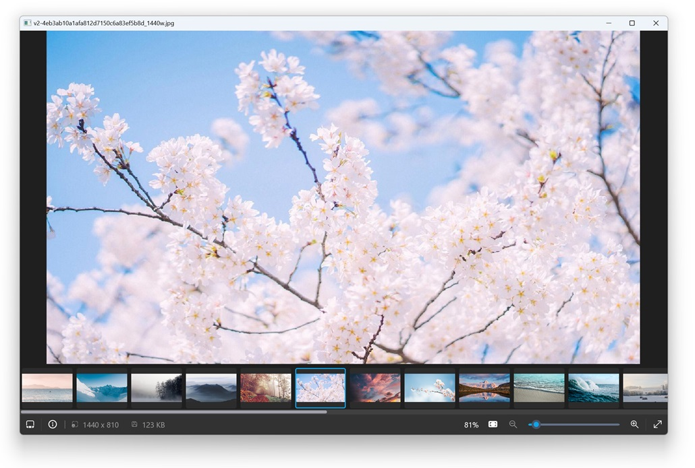

# 介绍

LCUI 是一个用于为桌面应用构建图形界面的 C 开发库，与其它 GUI 库/框架相比，功能、文档和例子都很少，这增加了开发者的使用难度，同时也使得开发者难以全面、准确地评估其实际的应用能力和潜力。

基于此，为了帮助开发者更好地认识和掌握 LCUI 的特性与优势，本教程以开发图像查看器为例，深入且直观地展示 LCUI 在实际项目中的各项能力。

之所以选择图像查看器，是因为作者曾经在使用 Windows 系统自带的“照片”应用时经常出现卡死、无法启动、无法缩放、启动缓慢等问题，于是就想开发一个启动迅速的图像查看器来取代它作为日常看图的工具。

## 实现的是什么程序？

我们将构建一个简单的图像查看器，包含以下界面：

1. **介绍**：展示应用图标、名称、描述、版本号和使用说明。
2. **图像查看**：显示图像，并支持通过鼠标和键盘操作切换图像、放大或缩小。
3. **工具栏**：位于图像查看界面底部，显示一些快捷按钮和状态信息。
4. **影片**：显示当前目录下的图像列表。
5. **信息**：显示图像信息。

程序的主要特点如下：

1. 可设置为图像文件的默认打开方式。
2. 启动快、图像加载快、内存占用少，对一般大小的图像能做到秒开。
3. 支持切换上一张和下一张图像。
4. 打开大尺寸图像时，实时显示图像加载进度。
5. 预览其它图像的缩略图。
6. 查看图像基本信息。

你可以从[这里](https://github.com/lcui-dev/kantu)下载源码，并按照 README.md 文档构建、运行和体验该程序。

## 你会学到什么？

- 分析需求并设计程序
- LCUI 开发的基础知识
- LCUI 开发工具和库的基本用法
- 使用 TypeScript 描述界面
- UI 组件的编写方法
- 多线程编程

## 适宜人群

- 具备 C/C++ 语言编程基础
- 了解 HTML、CSS、JavaScript
- 想尝试另一种桌面应用开发方式

## 前置知识

已阅读 LCUI 的[快速入门](https://lcui.org/docs/guide/quick-start/)和 [TypeScript](https://lcui.org/docs/guide/typescript) 文档。
