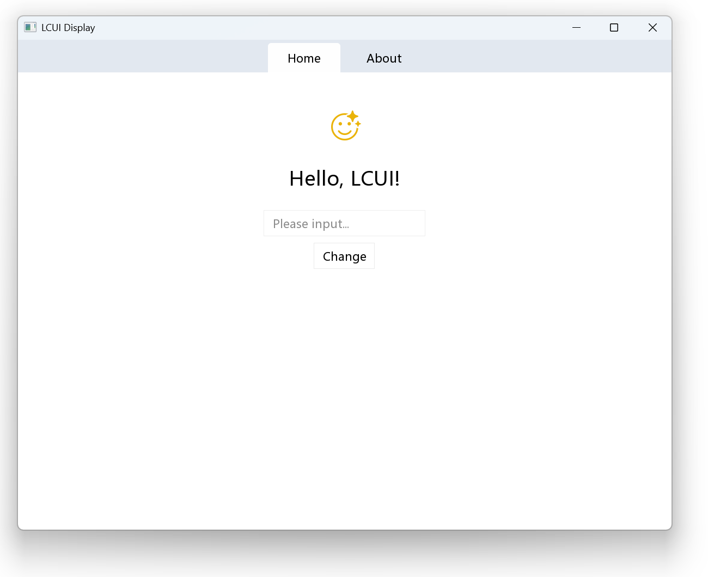

# 配置开发环境

本章节将逐步指导你完成开发环境的配置，并创建一个最小化的图像查看器项目。完成本章后你将能够：

- 使用 LCUI 命令行工具创建项目
- 使用 xmake 构建、运行、打包项目
- 掌握 LCUI 模板项目的定制方法

## 系统要求

在开始之前，请确保你的系统符合以下要求：

- 已安装 Node.js 20.11.0 或以上版本。[点此下载](https://nodejs.org/en)。
- 操作系统：Windows。
- 已安装以下工具：
  - [Git 版本管理工具](https://git-scm.com/)
  - [XMake 构建工具](https://xmake.io/)
  - [LCUI 命令行工具](https://github.com/lcui-dev/lcui-cli): 输入命令 `npm -g install @lcui/cli` 安装

## 创建项目

在你的项目目录内打开命令行窗口，输入以下命令创建一个名为 kantu 的项目：

```bash
lcui create kantu
```

## 构建项目

进入项目目录：

```bash
cd kantu
```

使用 LCUI 命令行工具构建：

```bash
lcui build
```

LCUI 命令行工具将会转换项目内的 TypeScript 模块为 C 源文件，然后调用 xmake 构建项目。

## 运行项目

```bash
xmake run
```

你将会看到示例程序的窗口。



## 打包和发布项目

运行以下命令打包项目的可执行文件和资源文件：

```bash
xmake pack
```

生成的安装包在 build/xpack/app 目录下，可用于发布。

## 配置编辑器

如果你使用的代码编辑器是 Visual Studio Code，为了让编辑器正确加载头文件，请修改 C/C++ 配置 - IntelliSense 配置中的 includePath 配置项，添加 LCUI 的头文件目录路径，像这样：

```json
{
  "configurations": [
    {
      "name": "Win32",
      "includePath": [
        "${workspaceFolder}/vendor/*/lib/*/include",
        "${workspaceFolder}/vendor/*/include"
      ]
    }
  ]
}
```

## 定制项目

我们已经体验了该示例项目，但项目内的示例代码对我们要开发的程序并没有用处，因此我们需要做些调整：

- 创建 src 目录，用于存放后续编写的源码
- 移动 app/global.css 文件到 src 目录内，将内容覆盖为：
  ```css title="src/global.css"
  @tailwind components;
  @tailwind utilities;

  * {
    box-sizing: border-box;
  }
  ```
- 删除 app 目录
- 更改 package.json 文件中的名称和描述
- 更改 xmake.lua 文件中的项目名称、版本、描述、源文件路径等信息，例如：
  ```lua title="xmake.lua"
  set_project("kantu")
  set_version("0.1.0")
  ...

  target("kantu")
      ...
      add_files("src/**.c")

  xpack("kantu")
      set_title("kantu")
      set_description("An image viewer")
      set_basename("kantu-v$(version)")
      add_targets("kantu")
      ...
  ```
- 更改 version.rc 文件中的文件描述、公司信息、版本号等信息，例如：
  ```c
        BEGIN
            VALUE "CompanyName", "留视软件"
            VALUE "FileDescription", "看图"
            VALUE "FileVersion", "0.1.0.0"
            VALUE "InternalName", "kantu.exe"
            VALUE "LegalCopyright", "Copyright (C) 2024-present, lcui.org"
            VALUE "OriginalFilename", "kantu.exe"
            VALUE "ProductName", "看图"
            VALUE "ProductVersion", "0.1.0.0"
        END
        BLOCK "040904b0"
        BEGIN
            VALUE "CompanyName", "LC's Software"
            VALUE "FileDescription", "KanTu"
            VALUE "FileVersion", "0.1.0.0"
            VALUE "InternalName", "version.rc"
            VALUE "LegalCopyright", "Copyright (C) 2024-present, lcui.org"
            VALUE "OriginalFilename", "kantu.exe"
            VALUE "ProductName", "KanTu"
            VALUE "ProductVersion", "0.1.0.0"
        END
  ```

## 小结

搭建 LCUI 项目比较简单，使用 `lcui create` 命令创建的项目已经包含构建、打包、运行所需配置，我们只需要做些简单的调整就可以开始开发。
