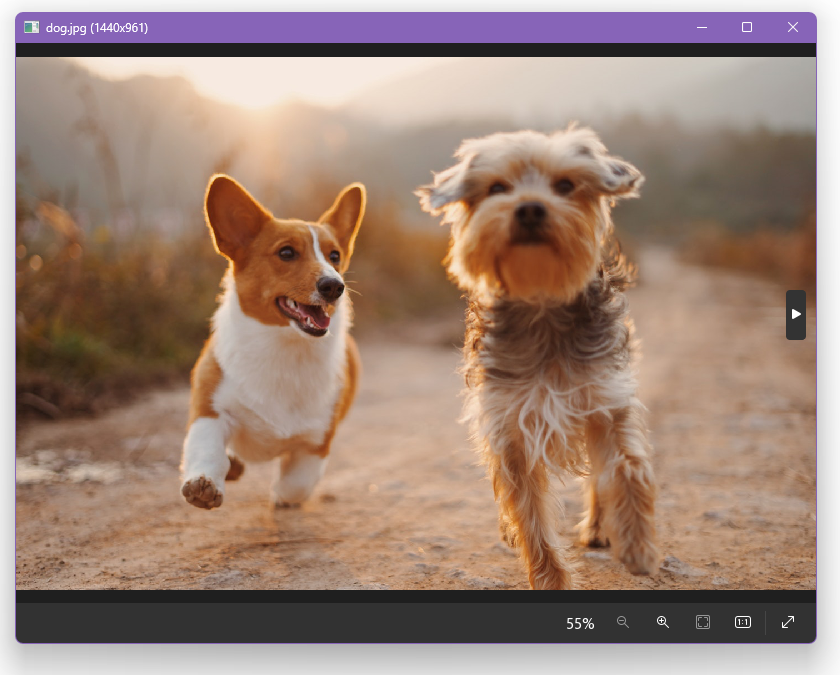

# 介绍

在本教程中，你将通过构建一个图片查看器来学习 LCUI 的基本功能。

## 我们将构建什么

我们将构建一个简单的图片查看器，它包含：

- 介绍界面：展示应用图标、名称、描述、版本号和用法
- 图像查看界面：显示图片，可通过鼠标和键盘操作切换上下一张、放大缩小图片

你可以从这里下载它的源码，按照源码目录内的 README.md 文档构建、运行和体验这个程序的效果。

学完本教程后，你将具备开始构建 LCUI 应用程序所需的基本技能。

## 概览

以下是你将在本教程中学习的内容概览：

- 创建项目：如何创建 LCUI 应用项目并快速开始开发自己的应用。
- 构建项目：如何编译项目源码并将构建产出的文件打包发布。
- 需求分析：如何理清需求并将其转化为一个个具体的开发事项。
- 功能设计：如何设计各个功能模块使其更易于开发和后续维护。
- 样式：使用 CSS、CSS Modules、Sass 等方式设置界面样式。
- 标记：使用 JSON、YAML、JSX 等方式描述界面。
- 状态控制：如何根据当前状态控制各个组件的样式和交互行为。
- 事件响应：如何响应事件并更新界面内容。

## 预备知识

本教程假设你对 C 语言编程有基本的理解，能够解决常见编译问题，且对 HTML 和 CSS 以及一些流行的界面开发技术有一定的了解。

教程中的代码片段仅供参考，以表达实现思路为主，并不会详细写明需要包含哪些标准库的头文件、声明哪些函数等细节，如果你发现这些代码编译失败，请自行补全头文件和相关符号声明。

## 系统要求

在开始本教程之前，请确保您的系统满足以下要求：

- 已安装 Node.js 20.11.0 或以上版本。[点此下载](https://nodejs.org/en)。
- 操作系统：Windows 或 Linux。
- 已安装以下工具：
  - [Git 版本管理工具](https://git-scm.com/)
  - [XMake 构建工具](https://xmake.io/)
  - [LCUI 命令行开发工具](https://github.com/lcui-dev/lcui-cli): 输入命令 `npm -g install @lcui/cli` 安装。

## 加入讨论

如果你对本课程有疑问或想提供反馈，您可以在 [Gitee](https://gitee.com/lc-soft/LCUI/issues/new) 或 [GitHub](https://gitee.com/lc-soft/LCUI/issues/new) 上问我们的社区。
