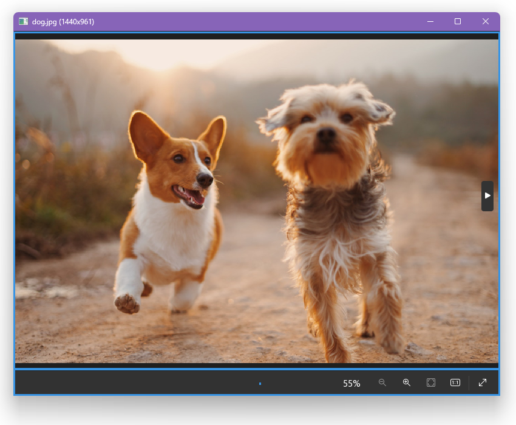
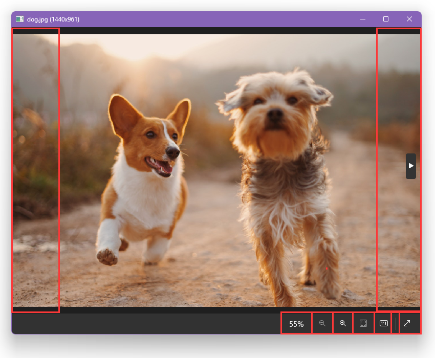
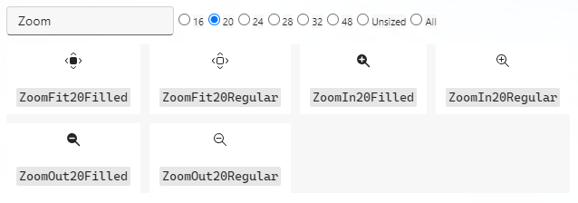

# 界面布局

让我们学习如何将图片查看界面拆解成多个组件，以及如何利用 LCUI 的布局能力排列这些组件。

## 拆分组件

首先，我们可以很容易看出界面内容由上下两个部分组成，如下图中标注的蓝色方框所示。
上面区域显示图片，底部的工具栏提供了一些快捷操作按钮。



然后，我们通过对这两个区域进一步地拆分，可以知道图片区域内包含两个切换按钮，而工具栏内包含缩放比例文本、放大、缩小、分割线等组件。如下图中标注的红色各色方库所示。



至此，我们就完成了组件拆分。

## 设计布局

图片区内的两个按钮位于两端，宽度固定，高度等于图片区域高度。有两种布局方式可选：

1. flex 布局。将图片区设为 flex 容器，然后将 [justify-content](https://developer.mozilla.org/zh-CN/docs/Web/CSS/justify-content) 属性值设为 space-between。
1. 绝对定位。将按钮的 [position](https://developer.mozilla.org/zh-CN/docs/Web/CSS/position) 属性值设为 absolute，然后分别用 left 属性和 right 属性调整按钮位置。

工具栏内的组件都靠右对齐，那么布局方式显而易见，将工具栏设为 flex 容器，然后将 justify-content 属性值设为 flex-end。

## 选取图标

`@lcui/react-icons` 图标库的图标都来自 [fluentui-system-icons](https://github.com/microsoft/fluentui-system-icons)，我们可以在该图标库项目提供的 [aka.ms/fluentui-system-icons](https://aka.ms/fluentui-system-icons) 页面里为图片查看界面选取合适的图标。以放大图标为例，英文名通常是 Zoom In，那么可以这样搜索：



从上图可看出 fluentui-system-icons 的图标有 16、20、24 等几种尺寸可选，图标命名方式是图标名+尺寸+风格。`@lcui/react-icons` 图标库的命名方式是图标名+风格，当风格为 Regular 时可以省略它。具体用法如下：

```tsx
import { ZoomIn } from "@lcui/react-icons";

<ZoomIn />
```

fluentui-system-icons 提供的几种尺寸图标是针对该尺寸优化的，看起来都是像素完美的。`@lcui/react-icons` 的图标使用的尺寸默认是 20，如果你的图标尺寸固定，且希望图标有更好的渲染效果，则可以指定 size 参数：

```tsx
<ZoomIn size={32} />
```

## 描述界面结构

结合上述的组件拆分和布局设计，我们可以得出以下结构：

```text
图片查看界面
  进度条
  图片区
    “上一张”按钮
    “下一张”按钮
  工具栏
    缩放比例
    缩小
    放大
    自适应
    原始比例
    分割线
    全屏
```

将这个结构转换成 JSX 表达式后，我们就能写出以下代码：

```tsx title=image-view.tsx
import React, { Text, Widget } from "@lcui/react";
import {
  ZoomOut,
  ZoomIn,
  ArrowMaximize,
  RatioOneToOne,
  Screenshot,
  TriangleLeftFilled,
  TriangleRightFilled,
  Image,
} from "@lcui/react-icons";

export default function ImageView() {
  return (
    <Widget>
      <Widget $ref="content" />
      <Widget $ref="prev">
        <TriangleLeftFilled />
      </Widget>
      <Widget $ref="next">
        <TriangleRightFilled />
      </Widget>
      <Widget>
        <Text $ref="percentage">100%</Text>
        <ZoomOut $ref="zoom_out" />
        <ZoomIn $ref="zoom_in" />
        <Screenshot $ref="fill" />
        <RatioOneToOne $ref="original" />
        <Widget />
        <ArrowMaximize $ref="maximize" />
      </Widget>
    </Widget>
  );
}
```

:::note
代码中的部分元素已经设置了 `$ref` 属性，以便于后续的代码能够直接操作它们。
:::

## 添加样式

现在的界面还没有样式，结合上文中提供的布局方式，以及你所具备的 CSS 基础，相信你能够很容易地写出 CSS 规则。大致流程是先编写 CSS 文件，然后在 tsx 中使用 import 语句导入该 css 文件，之后给各个元素设置 className 属性为对应的 css 类名。
