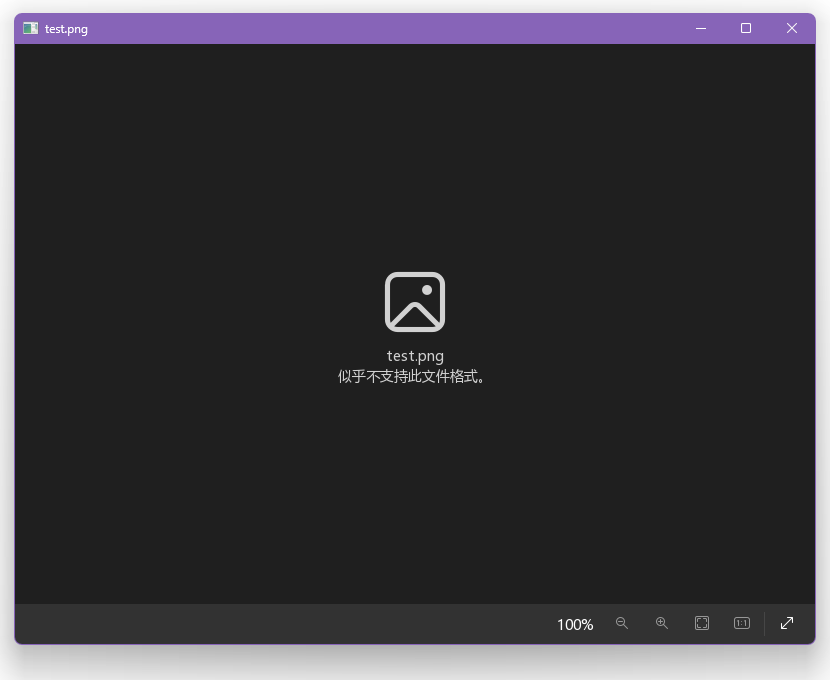

# 反馈图片加载状态

让我们学习如何获取图片的加载进度和结果，以及如何在界面上表达它们。

## 添加进度条

进度条是常见的用于展示进度的组件，最简单的实现方式是创建一个包含进度条的容器组件，然后将进度条的宽度设置为实际进度百分比。我们可以将之转换成这样的 JSX 表达式：

```tsx title=image-view.tsx
<Widget className={styles.progress}>
  <Widget $ref="progressbar" className={styles.bar} />
</Widget>
```

进度条的展示位置有多种，例如：图片区的顶部/中间/底部、工具栏左端，你可以根据自己的喜好选择一种。

## 获取图片加载状态

`ui_image_t` 对象在加载图片的过程中会产生 progress、load、error 事件，从事件名可知这三个事件分别在加载过程中、加载完成时、加载失败时触发。你可以调用 `ui_image_add_event_listener()` 和 `ui_image_remove_event_listener()` 函数添加和删除这些事件的处理函数。不过这函数的调用代码写起来比较长，你可以改用内联函数 `ui_image_on_事件名()` 和 `ui_image_off_事件名()`。

进度条应在每次加载图片时显示，在加载下一个图片前应该停止获取当前图片的加载状态以避免进度错乱。那么你应该在 `image_view_load_file()` 函数中添加图片事件的绑定和解绑代码，以及进度条的操作代码：

```diff
  void image_view_load_file(ui_widget_t *w, const char *file)
  {
          char *url;
          image_view_t *view = ui_widget_get_data(w, image_view_proto);
          image_controller_t *c = &view->controller;

+         if (view->controller.image) {
+                 ui_image_off_load(c->image, image_view_on_image_event, w);
+                 ui_image_off_error(c->image, image_view_on_image_event, w);
+                 ui_image_off_progress(c->image, image_view_on_image_event, w);
+                 ui_image_off_progress(c->image, image_view_on_image_start_load,
+                                       w);
+         }
          image_collector_load_file(&view->collector, file);
          image_controller_load_file(&view->controller, file);
          image_view_update(w);
+         ui_image_on_load(c->image, image_view_on_image_event, w);
+         ui_image_on_error(c->image, image_view_on_image_event, w);
+         ui_image_on_progress(c->image, image_view_on_image_event, w);
+         ui_image_on_progress(c->image, image_view_on_image_start_load, w);
+         ui_widget_set_style_unit_value(view->refs.progressbar, css_prop_width,
+                                        0, CSS_UNIT_PERCENT);
+         ui_widget_show(view->refs.progressbar);
```

注意，LCUI 的图片加载任务是在工作线程中异步执行的，对于较大的图片，你会在屏幕上看到图片一行行显示的过程，这意味着你可以在初次响应 progress 事件时拿到图片的尺寸并对其缩放，以避免用户看到大图片在加载完时突然缩小而产生突兀感。

```c title=image-view.c
void image_view_on_image_start_load(ui_image_event_t *e)
{
        image_view_reset(e->data);
        ui_image_off_progress(e->image, image_view_on_image_start_load,
                              e->data);
}
```

三个事件处理函数的代码量较少且有部分重复的代码，因此都可以合进同一个事件处理函数内：

```c title=image-view.c
void image_view_on_image_event(ui_image_event_t *e)
{
        image_view_t *view = ui_widget_get_data(e->data, image_view_proto);

        switch (e->type) {
        case UI_IMAGE_EVENT_PROGRESS:
                ui_widget_set_style_unit_value(
                    view->refs.progressbar, css_prop_width, e->image->progress,
                    CSS_UNIT_PERCENT);
                return;
        case UI_IMAGE_EVENT_LOAD:
                image_view_reset(e->data);
                break;
        case UI_IMAGE_EVENT_ERROR:
                logger_error("load image error: %d", e->image->error);
                image_view_update(e->data);
                break;
        default:
                break;
        }
        ui_widget_hide(view->refs.progressbar);
}
```

`ui_image_t` 对象中的 progress 成员记录了百分比加载进度，error 成员记录了加载失败时的错误码。对于 progress 事件，你只需从事件对象中拿到图片进度然后更新进度条宽度即可。而对于 error 事件，我们先调用 `image_view_update()`，等到后面再补充错误信息展示。

## 显示错误信息

在图片加载失败时，你需要在界面中显示图片文件名和错误原因以让用户知道什么图片加载失败了。纯文字太单调，你也可以加个图标。那么 JSX 表达式就是这样：

```tsx
<Widget $ref="tip" className={styles.tip}>
  <Image className={styles.icon} fontSize={80} />
  <Text $ref="filename" />
  <Text>似乎不支持此文件格式。</Text>
</Widget>
```

之后，在 `image_view_load_file()` 函数中更新 `filename` 组件内显示的图片文件名：

```c title=image-view.c
ui_text_set_content(view->refs.filename, path_basename(file));
```

然后，在 `image_view_update()` 函数中根据图片加载状态显示或隐藏错误提示：

```c title=image-view.c
if (image->state != UI_IMAGE_STATE_COMPLETE || image->error == PD_OK) {
        ui_widget_hide(view->refs.tip);
} else {
        ui_widget_show(view->refs.tip);
}
```

最后，我们将 `main()` 函数中的 `image_view_load_file()` 函数的参数改成任意文件的路径，编译并运行程序，你会看到这样的效果：


