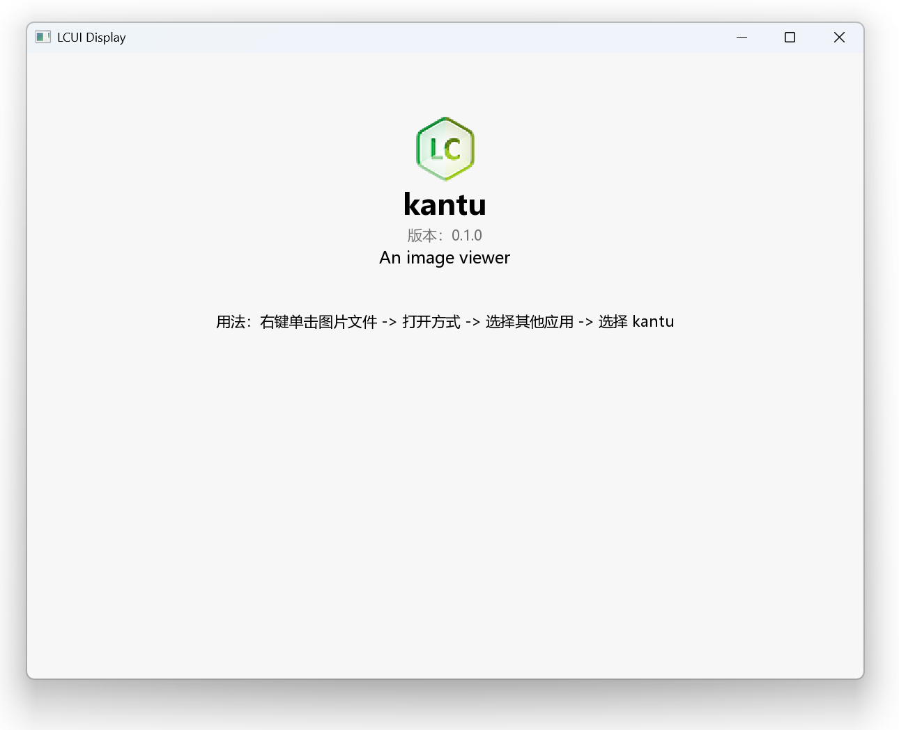

# 实现主界面

本章节将引导你从组件拆分和布局设计入手，逐步完成界面的编码和样式设置，最终实现一个主界面。完成本章后你将学会：

- TypeScript 的基础语法
- JSX 表达式的写法
- 为界面添加样式
- 将组件展示在窗口内
- 更改窗口标题

## 拆分组件

主界面展示了程序的各项信息，以文本为主，因此可按信息类型来划分组件，也就是每项信息为一个组件。

对于程序图标的展示，因为 LCUI 暂无功能类似于 `` 的组件，所以我们使用 CSS 的 background-image 属性将图标作为组件的背景图来显示。

## 设计布局

内容水平居中，从上到下排列展示每一项信息。

为方便调整内容外间距，我们将内容都放到一个容器组件内，通过设置其 margin-left 和 margin-right 属性为 auto 来实现水平居中。然后设置 margin-top 属性避免内容贴合上边界。为了让内容在窗口宽度过小时贴合左右边界，我们还应设置容器组件的 padding-left 和 padding-right 属性。

## 描述界面结构

结合上述的组件拆分和布局设计，我们可以得出以下结构：

```text
主界面
  容器
    头部容器
      图标
      名称
      版本
      描述
    用法介绍
```

让我们将它转换成 TypeScript 代码。首先使用 import 语句从 LCUI 的 React 库 `@lcui/react` 中引入基础组件：

```tsx title="src/home.tsx"
import { Text, Widget } from "@lcui/react";
```

引入项目根目录中的 package.json 文件以获取基本信息：

```tsx title="src/home.tsx"
import pkg from "../package.json";
```

接着定义组件函数，命名为 Home，作为默认导出：

```tsx title="src/home.tsx"
export default function Home() {
}
```

再在函数内添加 JSX 表达式：

```tsx title="src/home.tsx"
export default function Home() {
  return (
    <Widget>
      <Widget>
        <Widget>
          <Widget />
          <Text>{pkg.name}</Text>
          <Text>v{pkg.version}</Text>
          <Text>{pkg.description}</Text>
        </Widget>
        <Text>
          用法：右键单击图片文件 -&gt; 打开方式 -&gt; 选择其他应用 -&gt; 选择 {pkg.name}
        </Text>
      </Widget>
    </Widget>
  );
}
```

Widget 是基础组件，用途类似于 HTML 中的 `<div>`，可作为布局容器使用；然而，它并不具备文本显示功能，若要实现文本展示，我们还得依靠 Text 组件。

## 添加样式

现在的界面还没有样式，你可以在 CSS 文件中编写全局样式，然后在 tsx 文件中给组件设置 className 属性，就像这样：

```tsx title="src/home.tsx"
import { Text, Widget } from "@lcui/react";
import pkg from "../package.json";
import "./home.scss";

export default function Home() {
  return (
    <Widget className="home">
      <Widget className="container">
        <Widget className="header">
          <Widget className="logo" />
          <Text className="name">{pkg.name}</Text>
          <Text className="version">版本：{pkg.version}</Text>
          <Text className="description">{pkg.description}</Text>
        </Widget>
        <Text className="usage">
          用法：右键单击图片文件 -&gt; 打开方式 -&gt; 选择其他应用 -&gt; 选择{" "}
          {pkg.name}
        </Text>
      </Widget>
    </Widget>
  );
}
```

结合上文所提供的布局方法，以及你已有的 CSS 基础，相信你可以轻松编写出相应的 CSS 规则。

以下是参考 CSS。注意，你需要将 logo.png 图标文件添加到 src/assets 目录内。

```css title="src/home.scss"
.home {
  background: rgb(247, 247, 247);
  height: 100%;

  .container {
    padding: 60px 20px 20px 20px;
    max-width: 800px;
    margin: 0 auto;
  }
  
  .header {
    display: flex;
    flex-direction: column;
    align-items: center;
    width: 100%;
    margin-bottom: 40px;
  }
  
  .name {
    font-size: 28px;
    font-weight: bold;
    display: inline-block;
  }

  .version {
    color: #717171;
  }
  
  .description {
    font-size: 16px;
  }
  
  .logo {
    width: 64px;
    height: 64px;
    background-size: contain;
    background-position: center;
    background-image: url("./assets/logo.png");
  }
  
  .usage {
    text-align: center;
  }
}
```

## 编译 TypeScript

运行以下命令编译 src 目录内的 tsx 文件：

```terminal
lcui build
```

运行后，src 目录内会产生新的文件：

- `main.c`：包含 `main()` 函数实现。该文件仅在初次编译时创建。
- `main.h`：包含 LCUI 应用程序初始化实现代码。该文件在每次构建后更新。
- `home.c`: Home 组件源文件。该文件仅在初次编译时创建。
- `home.h`: Home 组件头文件。该文件仅在初次编译时创建。
- `home.tsx.h`：tsx 编译后的组件 C 源码，供 .c 源文件包含。

## 显示界面

直接运行此程序你会发现窗口内什么都没有，这是因为与窗口绑定的根组件是空的。

编辑 main.c，将 home 组件追加到根组件内：

```c title="src/main.c"
#include "main.h"

int main(int argc, char *argv[])
{
        app_init();
        // highlight-next-line
        ui_widget_append(ui_root(), ui_create_home());
        return app_run();
}
```




## 设置窗口标题

应用程序窗口标题默认是 `LCUI Display`，我们可以调用 `ui_widget_set_title()` 函数来更改为程序名称：

```c title="src/main.c"
#include "main.h"

int main(int argc, char *argv[])
{
        app_init();
        // highlight-next-line
        ui_widget_set_title(ui_root(), L"Kantu");
        ui_widget_append(ui_root(), ui_create_home());
        return app_run();
}
```

因为 LCUI 默认的显示模式是单窗口，该窗口与根级组件绑定，根组件的宽高、标题属性的变动都会同步到窗口。所以我们利用这一特性，通过修改根组件的 title 属性来设置窗口标题。

## 小结

我们完成了主界面的构建。首先进行组件拆分，按信息类型划分。接着设计布局，实现内容水平居中、上下排列。然后用 TypeScript 描述界面结构，添加样式。编译 TypeScript 后，将主界面组件添加到根组件显示，并通过修改根组件的标题属性设置窗口标题。

想要进一步地练习？你可以试试以下任务：

1. 美化主界面。
1. 添加主页、反馈问题的链接。
1. 添加展示构建时间、LCUI 版本号、构建工具信息。
